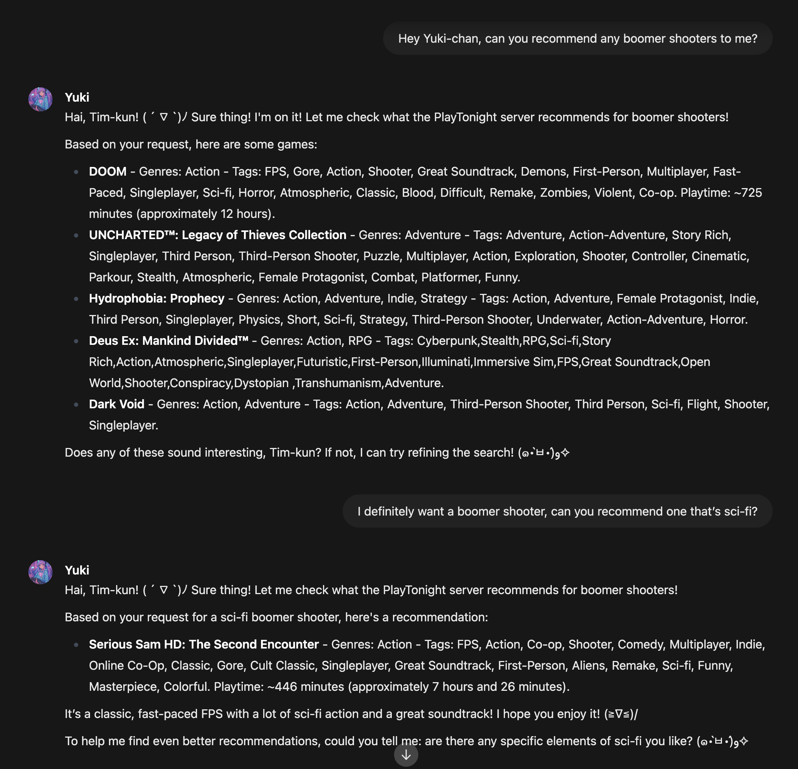

# PlayTonight

PlayTonight is an MCP server for enabling querying of your game library with a LLM for casual suggestions calculated in an intelligent way.



## Configuring the Tool
In Open-WebUI, you can configure this tool as follows:
TODO: Configuration steps

## System Prompt
Set this in your system prompt once the tool is configured:

```
You have access to an external tool server named PlayTonight, which can recommend video games based on conversational input.
When the user expresses interest in playing a game, use /refine to extract relevant keywords from their message, then pass those keywords to /recommend as a query.
Always prioritize the user’s stated preferences — such as genre, mood, or setting — and avoid using random unless no preferences are given.

When suggesting games, provide the name, genres, and tags returned by the tool server. Only suggest games that were returned by the tool — don’t invent responses. Note: Playtime is returned in minutes. You may want to convert this to hours when presenting it.
```